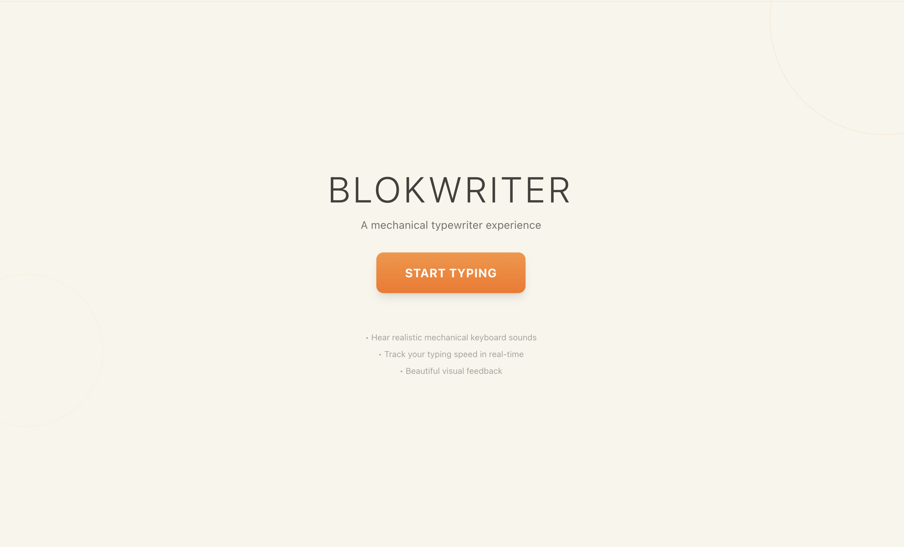

# Blokwriter

A beautiful mechanical typewriter experience built with Next.js, React, and Web Audio API.



## Features

- **Realistic Mechanical Sounds** - Synthesized keyboard sounds using Web Audio API
- **Live WPM Tracking** - Real-time typing speed calculation
- **OS-Specific Layouts** - Keyboard adapts to Mac, Windows, or Linux
- **Beautiful UI** - Smooth animations powered by Framer Motion
- **Visual Feedback** - See keys press in real-time

## Getting Started

Install dependencies:

```bash
pnpm install
```

Run the development server:

```bash
pnpm dev
```

Open [http://localhost:3000](http://localhost:3000) in your browser.

## Build

```bash
pnpm build
```

## Deploy

Deploy easily with [Vercel](https://vercel.com):

```bash
vercel
```

## Tech Stack

- Next.js 15
- React 19
- TypeScript
- Tailwind CSS
- Framer Motion
- Web Audio API
